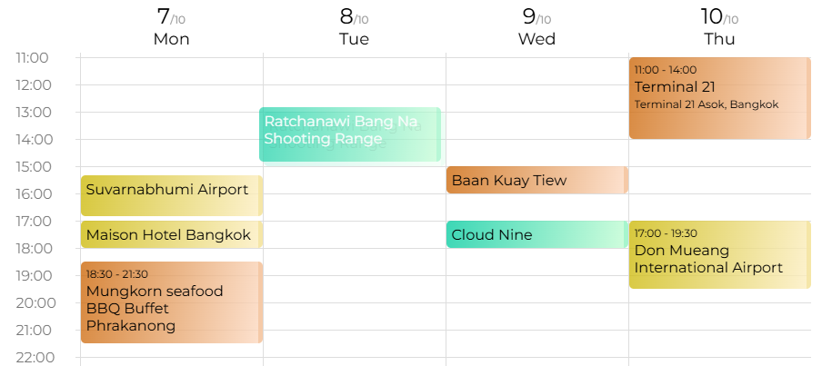
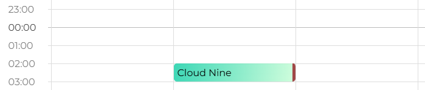

# Trip Schedule

Trip Schedule was created for my 2024 trip to Thailand. It is designed to make organizing plans simple and sharing them with friends effortless.

> 👉 https://tommyinb.github.io/trip-schedule/

## Drag and Drop

During travel, unexpected situations, like oversleeping, traffic jams, or simple mistakes, can cause immediate changes to the schedule. Having an effortless way to **adjust plans**, such as drag-and-drop functionality, is an absolute necessity.

Implementing drag-and-drop in _React_, however, is no easy task. Especially when encapsulation and top-down hierarchy, features _React_ takes pride in, posed challenges rather than advantages in this case. To overcome this, I introduced a `<Desk>` component to work alongside the `<Table>` component. Think of it as a timetable sheet placed neatly on a school desk.

`<Table>` focuses solely on rendering and positioning columns, cells, and cards, maintaining its simplicity and clarity. Meanwhile, `<Desk>` handles drag-and-drop interactions and calculates actions based on the layout rendered. This separation allows `<Desk>` to manage touch events independently, preserving the clean and elegant structure of the `<Table>` component. The result is a clear, **maintainable**, and effective solution for a full drag and drop feature.

## Thumb-Friendly Design

We all have friends with big thumbs, and overly easy drag-and-drop functionality can lead to accidental disruptions of carefully laid plans. We’ve all been there.

To strike a balance between convenience and safety, the final version uses a **double-click** to create a card and a **long press** to initiate a drag. This approach ensures that actions are intentional while maintaining an intuitive and user-friendly interface.

## Activity Hours

Unlike regular daily schedules, travel days can stretch well into the **late night**. A standard timetable from 00:00 to 23:59 simply doesn’t cut it. Especially for a trip to Thailand, with its vibrant nightlife, extending the timetable to 3:00 am becomes an unavoidable user requirement, doesn't it?

## Avoiding Closed Doors

I’ve lost count of how many times, during past travels, we arrived at restaurants or shops only to find them closed. A good app should address this by checking the **opening hours** of a place and highlighting a card in red if it falls outside the correct time slot.

## Seamless Sharing

Keeping everyone in the group on the same page is essential, and uploading the plan online has become standard practice. Thanks to modern serverless architecture, implementing this in `<Share>` with `firebase/storage` takes just a few lines of code. Generating a **shareable link**, make it easy for friends to view the plan on their phones, laptops, or tablets.

> https://tommyinb.github.io/trip-schedule/?shareId=1jga8d2w312 ✈️  
> Have a look at my Bangkok trip ☝️
